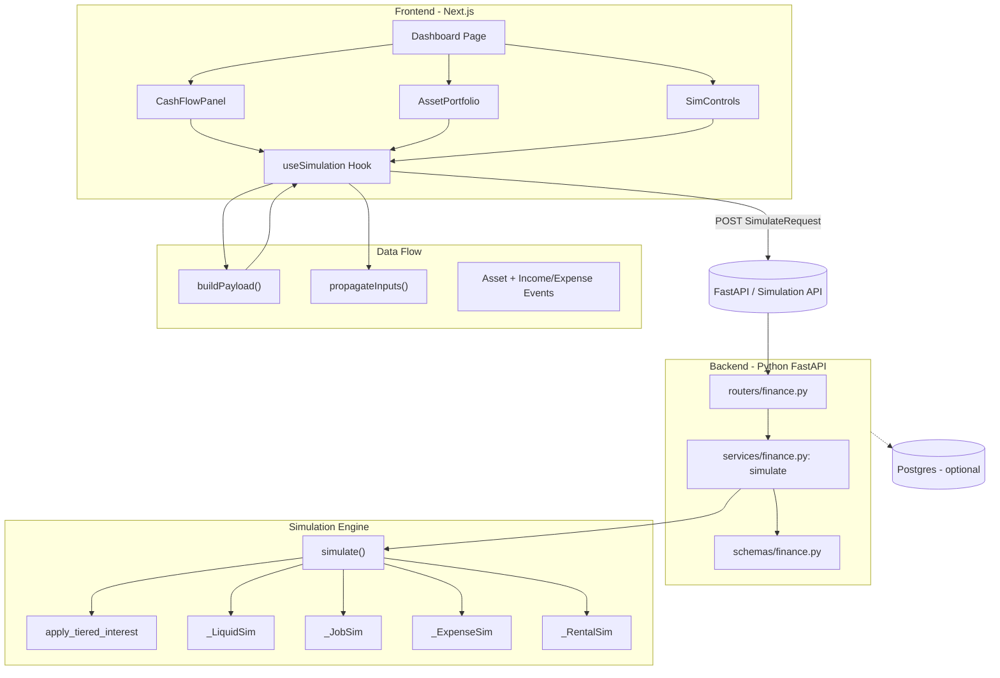

```mermaid
flowchart TD

%% ================= FRONTEND =================
subgraph FE[Frontend - Next.js]
  DASH[Dashboard Page]
  HOOK[useSimulation Hook]

  CASH[CashFlowPanel]
  ASSETS[AssetPortfolio]
  CONTROLS[SimControls]

  DASH --> CASH
  DASH --> ASSETS
  DASH --> CONTROLS

  CASH --> HOOK
  ASSETS --> HOOK
  CONTROLS --> HOOK
end

%% ================= API =================
API[(FastAPI / Simulation API)]

HOOK -->|POST SimulateRequest| API

%% ================= BACKEND =================
subgraph BE[Backend - Python FastAPI]

  ROUTES[routers/finance.py]
  SERVICE["services/finance.py: simulate"]
  SCHEMAS[schemas/finance.py]

  ROUTES --> SERVICE
  SERVICE --> SCHEMAS
end

API --> ROUTES

%% ================= SIMULATION ENGINE =================
subgraph SIM[Simulation Engine]

  SIMFUNC["simulate()"]
  TIER["apply_tiered_interest"]

  LIQ["_LiquidSim"]
  JOB["_JobSim"]
  EXP["_ExpenseSim"]
  RENT["_RentalSim"]

  SIMFUNC --> LIQ
  SIMFUNC --> JOB
  SIMFUNC --> EXP
  SIMFUNC --> RENT
  SIMFUNC --> TIER
end

SERVICE --> SIMFUNC

%% ================= DATA FLOW =================
subgraph FLOW[Data Flow]

  PAYLOAD["buildPayload()"]
  PROP["propagateInputs()"]
  EVENTS[Asset + Income/Expense Events]

  HOOK --> PAYLOAD
  PAYLOAD --> HOOK

  HOOK --> PROP
end

%% ================= DATABASE =================
DB[(Postgres - optional)]
BE -.-> DB

```
